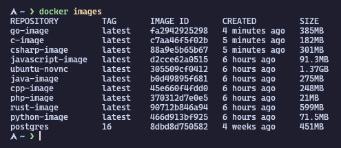
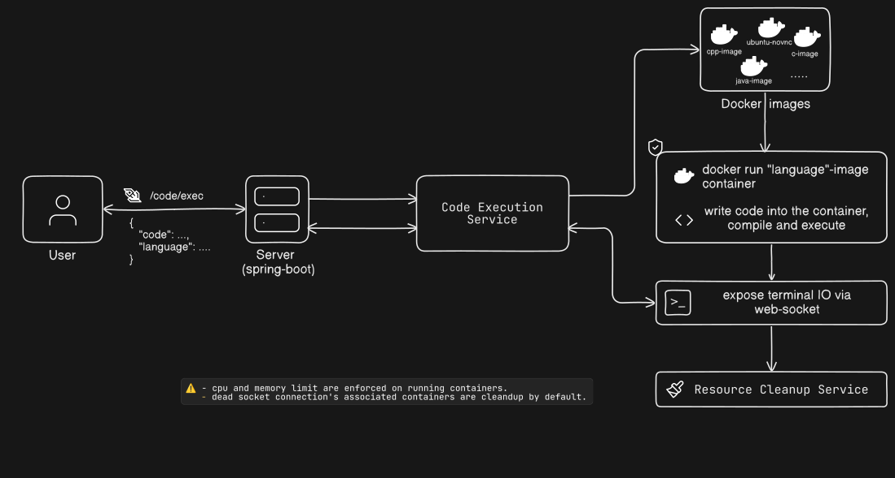

# Sandbox-backend

The repository is a part of [Sandbox](https://github.com/foskey51/sandbox/). A desktop application designed for exploring multiple programming language, learning web-dev (html, css, js) and exploring linux(ubuntu) all powered by docker. 

## Installation

### Step 1: setup docker container images required
````
cd src/main/resources/sandbox_dockerfiles && docker-compose -f docker-compose.yaml up --build -d
````



verify that you have the above images set-up.

### Step 2: run spring-boot backend
refer ``example.application.properties`` to setup env.
````
gradle bootRun
````
> ⚠️ **Note:** Make sure you have privilege to run docker. If it doesn't work try prefixing the above command with sudo.

## System design


> **📝 Developer Note:** <br>
> I wanted to experiment with Docker, so I used it to build this project. It’s inspired by how online compilers like ([onlinegdb](https://www.onlinegdb.com/), [programiz](https://www.programiz.com/c-programming/online-compiler/)...) even leetcode work. <br>
> Many of which are powered by [Judge0](https://github.com/judge0/judge0) using KVM.