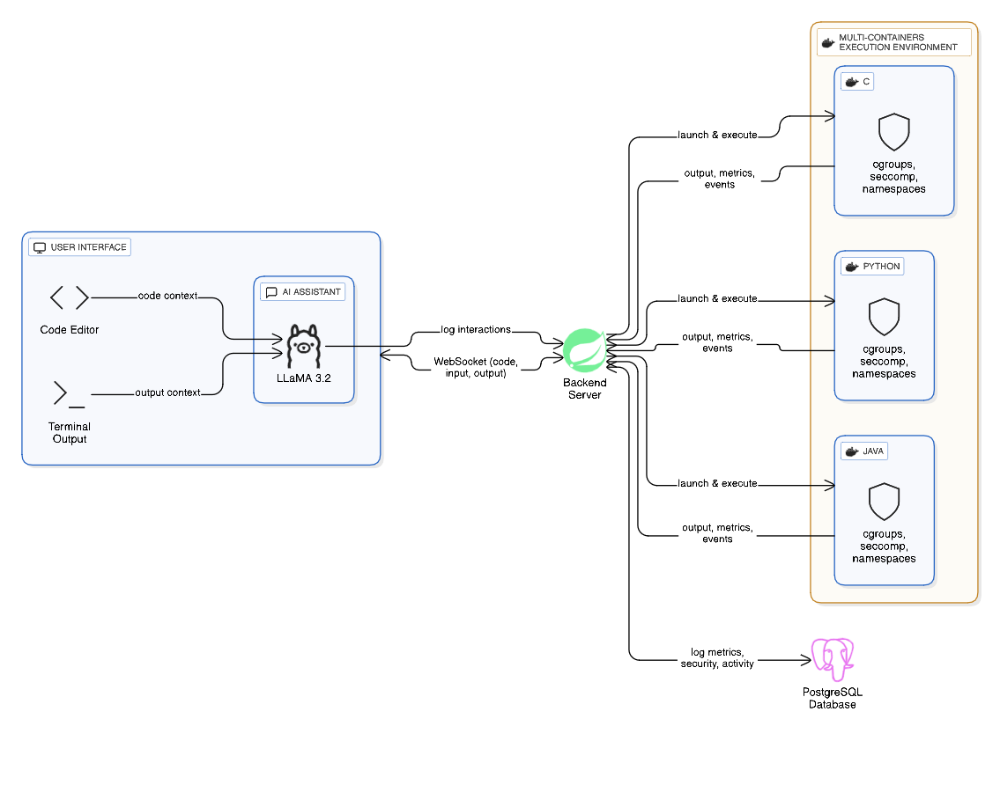

# [Sandbox](https://github.com/foskey51/sandbox/)-backend

## Proposed System Architecture


## Steps to install

### Setup env
````
example.application.properties -> application.properties
````

### Build and run
````
sudo gradle build && sudo gradle bootRun
````
